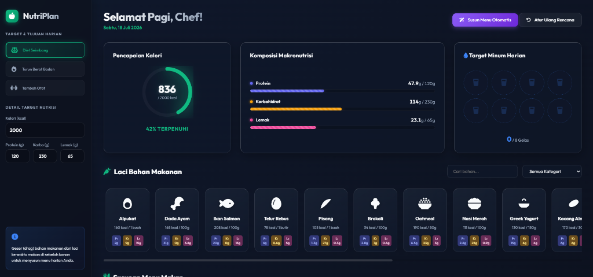

<div align="center">
  <h1>🥗 Smart Nutrition Planner</h1>
  <p><i>An Interactive Web Application for Planning Your Daily Meals & Nutrition</i></p>
  
  [](#)
  [](#)
  [](#)
</div>

---

## 🚀 Live Demo

**[Click here to view the Live Demo of Smart Nutrition Planner!](https://5amuel02.github.io/nutrition-planner/)**

## 🌟 About The Project

**Smart Nutrition Planner** is a pure frontend web application (Vanilla JS, HTML, CSS) designed with a modern *Glassmorphism* UI/UX. This application allows users to plan their daily meals using an intuitive drag-and-drop interface, while automatically tracking macronutrients (Protein, Carbohydrates, Fat) and calories in real-time.

This project is perfect for showcasing front-end development skills, advanced DOM manipulation, client-side state management, and responsive web design.

## ✨ Key Features

- 🖱️ **Drag & Drop Interaction:** A highly natural meal planning experience. Drag ingredients from the drawer to meal slots (Breakfast, Lunch, etc.).
- 📊 **Real-time Nutrition Calculation:** Circular calorie charts and macronutrient progress bars that update instantly as food is added.
- 🪄 **Magic Auto-Plan:** Don't know what to eat? A single click automatically generates a nutritious menu based on your calorie target.
- 💧 **Water Intake Tracker:** Track your daily water consumption with an interactive glass interface.
- 🃏 **Smart Recipe Recommendations:** The app suggests healthy recipes (complete with 3D visual effects) based on the ingredients on your plate.
- 💾 **Local Storage Persistence:** The app automatically remembers your menu and targets even if the browser is closed. Your data is safe!
- 📱 **100% Responsive Design:** Looks stunning on desktop screens, tablets, and even the smallest smartphones.

## 🚀 Getting Started

This project doesn't require complex server installations or NPM dependencies. You can run it directly in your browser!

1. **Clone the repository:**
   ```bash
   git clone https://github.com/5amuel02/nutrition-planner.git
   ```
2. **Open the directory:**
   Navigate into the cloned folder.
3. **Run:**
   Simply open the `index.html` file using your preferred modern browser (Chrome, Firefox, Safari, Edge).
   *Alternatively, you can use the **Live Server** extension in VSCode for the best experience.*

## 🎨 Screenshots



## 🛠️ Built With

- **HTML5:** Clean semantic structure.
- **CSS3:** Utilizing CSS Grid & Flexbox, CSS variables, *Glassmorphism* effects (backdrop-filter), and CSS Animations. No external frameworks like Bootstrap or Tailwind.
- **Vanilla JavaScript (ES6+):** Core application logic, native browser drag-and-drop API, and *Local Storage* management.
- **FontAwesome:** Provides a collection of modern vector icons (SVG based).
- **VanillaTilt.js & Canvas-Confetti:** Ultra-lightweight third-party libraries for added "Wow Factor" visual effects.

## 🤝 Contributing

Contributions are what make the open source community such an amazing place to learn, inspire, and create. Any contributions you make are **greatly appreciated**.

1. Fork the Project
2. Create your Feature Branch (`git checkout -b feature/AmazingFeature`)
3. Commit your Changes (`git commit -m 'Add some AmazingFeature'`)
4. Push to the Branch (`git push origin feature/AmazingFeature`)
5. Open a Pull Request

## 📜 License

Distributed under the MIT License. See `LICENSE` for more information.

---
<div align="center">
  Built with ❤️ by <a href="https://github.com/5amuel02">5amuel02</a>
</div>
